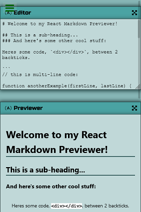

# freeCodeCamp Front End Development Libraries Projects clone

The 5 projects in this repo are part of the [freeCodeCamp Front End Development](https://www.freecodecamp.org/learn/front-end-libraries/#front-end-libraries-projects) curriculum. Every project passed all the tests from freeCodeCamp. 

My primary goal is to pass all the tests from freeCodeCamp. But at the same time I try to style the apps to look as close to the original design as possible. As I am not experience in UI design I reckon it's better to clone an existing one instead of designing something that doesn't look good.

## Links to finished clone
For more info on each project, please click on the link or on the picture of each project below.

### 1. [Random Quote Machine](./random-quote-machine)

### 2. [Markdown Previewer](./markdown-previewer)

### 3. [Drum Machine](./drum-machine)

### 4. [JavaScript Calculator](./javascript-calculator)

### 5. [25 + 5 Clock](./pomodoro-timer)

