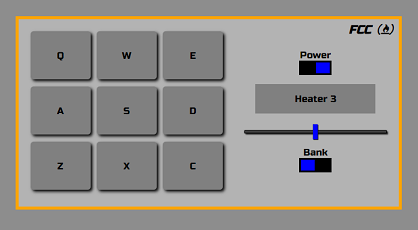
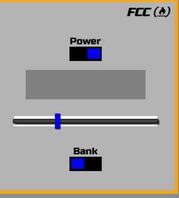

# freeCodeCamp Drum Machine clone

This is a clone of [Build a Drum Machine](https://www.freecodecamp.org/learn/front-end-libraries/front-end-libraries-projects/build-a-drum-machine) from freeCodeCamp.

## Screenshot of the finished clone



## What technologies were used?

- React (create-react-app)
- SCSS for styling purpose

## Links to source code and live site:

- [Source files on Github](https://github.com/1codingguy/fcc-frontend-projects/tree/main/drum-machine)
- [Live site deployed with Netlify](https://fcc-drum.netlify.app/)
- [The original app from freeCodeCamp](https://codepen.io/freeCodeCamp/full/MJyNMd)

## What does the app do?

- Play an instrument audio clip when either:
  - press on a key with the keyboard, or
  - click on one of the keypads on the screen.

## How to navigate this project? Click on the link for related source code:

1. The Power button is ON when the app starts. If the power button is toggled to off, the volume slider ([See here](https://github.com/1codingguy/fcc-frontend-projects/blob/main/drum-machine/src/App.js#L45)) and bank buttons ([See here](https://github.com/1codingguy/fcc-frontend-projects/blob/main/drum-machine/src/Btn.js#L7)) are disabled via the `disabled` attribute in the element. Keypads and keypress are disabled via conditional statements ([See here](https://github.com/1codingguy/fcc-frontend-projects/blob/main/drum-machine/src/context.js#L46) and [here](https://github.com/1codingguy/fcc-frontend-projects/blob/main/drum-machine/src/context.js#L57))
2. Make use of the `useContext` hook from React to avoid prop drilling. ([See here](https://github.com/1codingguy/fcc-frontend-projects/blob/main/drum-machine/src/context.js))
3. Handling click and keypress events:

- a. When a keypad is clicked, `handleClick()` is called to set the value of `pressedKey` state variable. ([See here](https://github.com/1codingguy/fcc-frontend-projects/blob/main/drum-machine/src/context.js#L39))
- b. Event listener is added to the document to listen for `keypress` event ([See here](https://github.com/1codingguy/fcc-frontend-projects/blob/main/drum-machine/src/context.js#L115)). When a key is pressed on the keyboard, `handleKeypress` is called to set the value of `pressedKey` state variable if that key exists in the `data` array.
- c. Either step a or step b above triggers `setPressedKey()` and therefore re-rendering, which triggers this `useEffect()` ([See here](https://github.com/1codingguy/fcc-frontend-projects/blob/main/drum-machine/src/context.js#L123)) which in turn calls the `executeKeyActions()` ([See here](https://github.com/1codingguy/fcc-frontend-projects/blob/main/drum-machine/src/context.js#L63)).

## Features of the app:

- Toggle between two kinds of instruments (heater kit and smooth piano kit) with the `bank` button.
- Control the playing volume with the volume slide bar.
- The display panel shows:
  - the name of the playing instrument sound;
  - the kind instrument after toggling the `bank` button;
  - the volume level after adjusting the volume slide bar, which fades out after one second.
- A power button that disables the volume slide bar and all the buttons/ keypads when toggled off.

## What are the objectives of this clone?

1. The primary goal is to get all of the tests to pass as this project is part of the "Front End Development" curriculum on freeCodeCamp.
2. Get the app to look as close to the original design as possible.
   - As I am not experienced in UI design I reckon it's better to clone an existing one instead of designing something that doesn't look good.

## Things learnt in the process:

#### Dynamically store reference to an element with `ref` attribute

- To play the audio clip according to the keypad clicked/ pressed, we need to access the relevant `<audio>` element.
- In the first version of build, I accessed the element with `document.getElementById()`, which is the "classic" approach in JavaScript. But read somewhere that such approach should be avoided in React.
- The correct way in React to access DOM element is via `useRef()` hook.
- When creating each keypad element, store a reference in the `audioRef` object via `ref` attribute in each `<audio>` element dynamically, like so: `ref={(element) => (audioRef.current[item.letter] = element)}`. ([Or see here](https://github.com/1codingguy/fcc-frontend-projects/blob/main/drum-machine/src/Key.js#L22))

## Problem encounter but not sure how to fix:

#### Unable to use "react-icons" for the freeCodeCamp logo.

- With [react-icons](https://react-icons.github.io/react-icons/) the freeCodeCamp logo couldn't be set as italic, also unable to get the font size right.
- Need to use font-awesome CDN instead.

## What can be further improved?

1. Build a responsive UI

   - The original app UI is responsive. But I failed to notice it until I was almost finished with the app.

2. Improve the look of the volume slide bar.
   - The volume slide bar has a white padding if opened with Firefox (shown in the picture below), but not with Chrome and Edge. The original app has the same problem. (Note: IE fails to load both the original app and my clone completely.)



> <figcaption>Volume bar has a white padding when opened with Firefox</figcaption>

## How can you clone and tweak this project?

From your command line, first clone this repo:

```
# Clone this repository
$ git clone https://github.com/1codingguy/fcc-frontend-projects.git

# Go into the repository
$ cd fcc-frontend-projects/drum-machine

# Remove current origin repository
$ git remote remove origin

```

Then you can install the dependencies using NPM:

```
# Install dependencies
$ npm install

# Start development server
$ npm start
```

Happy coding!

---

## Author

**coding-guy**

- [GitHub](https://github.com/1codingguy)
- [Blog](https://blog.coding-guy.com/)
- [Twitter](https://twitter.com/1codingguy)
