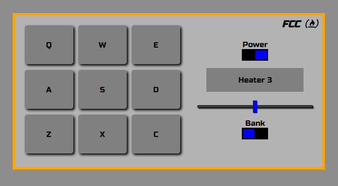
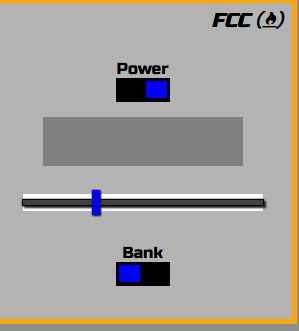

# freeCodeCamp Drum Machine clone

This is a clone of [Build a Drum Machine](https://www.freecodecamp.org/learn/front-end-libraries/front-end-libraries-projects/build-a-drum-machine) from freeCodeCamp.

## Screenshot of the finished clone



## What technologies were used?

- React
- SCSS: for styling purpose.

## Links to source code and live site:

- [Source files on Github](https://github.com/1codingguy/fcc-frontend-projects/tree/main/drum-machine)
- [Live site deployed with Netlify](https://fcc-drum.netlify.app/)

## What does the app do?

- Play an instrument audio clip when either:
  - press on an indicated key with keyboard or
  - click on one of the key buttons on the screen.

## Features of the app

- Toggle between two kinds of instruments (heater kit and smooth piano kit) with the `bank` button.
- Control the playing volume with the volume slide bar.
- The display panel shows:
  - the name of the playing instrument sound;
  - the kind instrument after toggling the `bank` button;
  - the volume level after adjusting the volume slide bar, which fades out after one second.
- A power button that disable the slide bar and all the buttons when toggled to off.

## What are the objectives of this clone?

1. The primary goal is to get all of the tests to pass as this project is part of the "Front End Development" curriculum on freeCodeCamp.
2. Get the app to look as close to the original design as possible.
   - As I am not experience in UI design I reckon it's better to clone an existing one instead of designing something that doesn't look good.

## Things learnt and reviewed in the process:

1. How to render an empty space: `<span>&nbsp;&nbsp;</span>` is needed for the display panel when there's nothing to display, otherwise the width of the display panel gets squashed since there's nothing in the container. ([Reference link](https://stackoverflow.com/questions/46656476/rendering-empty-space-in-react))

2. Listen to key down event with a combination of `useEffect()` and `document.addEventListener()`. ([Reference link](https://stackoverflow.com/questions/37440408/how-to-detect-esc-key-press-in-react-and-how-to-handle-it/46123962))

3. How to play audio clip. ([Reference link](https://stackoverflow.com/questions/18826147/javascript-audio-play-on-click))

4. How to adjust playing volume. ([Reference link](https://stackoverflow.com/questions/33747398/html-audio-tag-volume))

5. When pressing/ clicking a key in quick succession, how to restart playing the audio clip after each press/ click. ([Reference link](https://stackoverflow.com/questions/17636310/play-audio-and-restart-it-onclick))

## Problems encounter but not sure how to fix

#### Unable to use "react-icons" for the freeCodeCamp logo.

- With [react-icons](https://react-icons.github.io/react-icons/) the freeCodeCamp logo couldn't set as italic, also unable to get the font size right.
- Need to use font-awesome CDN instead.

## What can be further improved?

1. Build a responsive UI

   - The original app UI is responsive. But I failed to notice it until I was almost finished with the app.

2. Improve the look of volume slide bar.
   - The volume slide bar has a white padding if opened with Firefox (shown in the picture below), but not with Chrome and Edge. The original app has the same problem. (Note: IE fails to load both original app and my clone completely.)



<figcaption>Volume bar has a white padding when opened with Firefox</figcaption>

## How can you clone and tweak this project?

From your command line, first clone this repo:

```
// Clone this repository
$ git clone https://github.com/1codingguy/fcc-frontend-projects.git

// Go into the repository
$ cd fcc-frontend-projects/drum-machine

// Remove current origin repository
$ git remote remove origin

```

Then you can install the dependencies using NPM:

```
// Install dependencies
$ npm install

// Start development server
$ npm start
```

Happy coding!

---

## Author

**coding-guy**

- [GitHub](https://github.com/1codingguy)
- [Blog](https://blog.coding-guy.com/)
- [Twitter](https://twitter.com/1codingguy)
- [LinkedIn](https://www.linkedin.com/in/1codingguy/)
