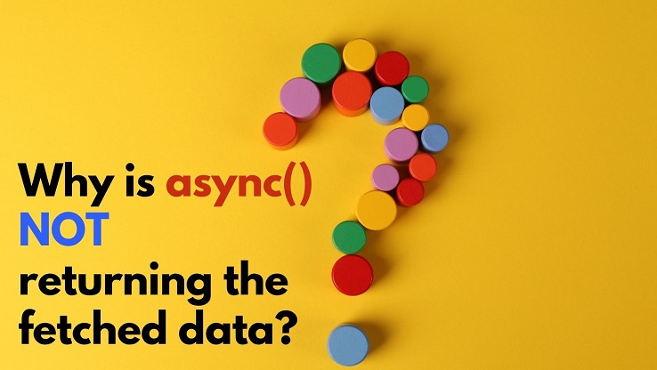

# freeCodeCamp Random Quote Machine clone

This is a clone of [Build a Random Quote Machine](https://www.freecodecamp.org/learn/front-end-libraries/front-end-libraries-projects/build-a-random-quote-machine) from freeCodeCamp.

### Screenshot of the finished clone


## What technologies were used?

- React (create-react-app)
- SCSS for styling purpose

## Links to source code and live site:

- [Source files on Github](https://github.com/1codingguy/fcc-frontend-projects/tree/main/random-quote-machine)
- [Live site deployed with Netlify](https://fcc-quote.netlify.app/)
- [The original app from freeCodeCamp](https://codepen.io/freeCodeCamp/full/qRZeGZ)

## Blog post about `async()` and `promise`:

In the build process, I learnt about the gotcha when fetching data with `async()`/`promises` and wrote a blog post about it (it's my first blog post). You can read the post by clicking on the picture below:

[](https://blog.coding-guy.com/why-is-async-not-returning-the-fetched-data)


## How to navigate this project? Click on the link for related source code:

### Build steps:

1. Inspect the original app and grab available resources:
  - The original app uses a json file contains all the quotes and authors. Use fetch API ([See here](https://github.com/1codingguy/fcc-frontend-projects/blob/main/random-quote-machine/src/getData.js)) to grab this json file.
  - The background and font colors are repeating instead of randomly generated. So I used Firefox devTool to copy the HEX code of all the colors used, save it into `colors.js` ([See here](https://github.com/1codingguy/fcc-frontend-projects/blob/main/random-quote-machine/src/colors.js)).

2. Import resources:
  - font-family "Raleway" from Google fonts.
  - font-awesome icons for quote, Twitter and Tumblr icons.
3. Get the layout right with JSX and SCSS.
4. Define state variables and `handleClick` function.

### Run steps:

1. When the app starts:

- fetch the json file contains quotes and authors. Save this into the `quotes` state variable.
- display the quote and author in `quotes[0]`.
- use the color in `colors[0]`.

2. When the `New quote` button is clicked, `handleClick()` is triggered, which:

- generates two random indices according to the length of `quotes` and `colors` respectively.
- new quote and color are used according to the random indices generated ([See here](https://github.com/1codingguy/fcc-frontend-projects/blob/main/random-quote-machine/src/App.js#L20)).

## What are the objectives of this clone?

1. The primary goal is to get all of the tests to pass as this project is part of the "Front End Development" curriculum on freeCodeCamp.
2. Get the app to look as close to the original design as possible.
   - As I am not experienced in UI design I reckon it's better to clone an existing one instead of designing something that doesn't look good.

## What can be further improved?

- Can't figure out how the animation works in the original app after clicking the `new quotes` button. In my clone, I used simple `transition` property but that isn't the same as in the original app.

## How can you clone and tweak this project?

From your command line, first clone this repo:

```
# Clone this repository
$ git clone https://github.com/1codingguy/fcc-frontend-projects.git

# Go into the repository
$ cd fcc-frontend-projects/random-quote-machine

# Remove current origin repository
$ git remote remove origin

```

Then you can install the dependencies using NPM:

```
# Install dependencies
$ npm install

# Start development server
$ npm start
```

Happy coding!

---
## Author

**coding-guy**

- [GitHub](https://github.com/1codingguy)
- [Blog](https://blog.coding-guy.com/)
- [Twitter](https://twitter.com/1codingguy)
