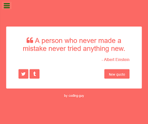

# Random Quote Machine - freeCodeCamp

This is a solution to the [Build a Random Quote Machine](https://www.freecodecamp.org/learn/front-end-libraries/front-end-libraries-projects/build-a-random-quote-machine) from freeCodeCamp.

## Table of contents

- [Overview](#overview)
  - [Objective](#objective)
  - [Screenshot](#screenshot)
  - [Links](#links)
- [My process](#my-process)
  - [Technologies used](#technologies-used)
  - [Build steps](#build-steps)
  - [Run steps](#run-steps)
- [Further improvement](#further-improvement )
- [Author](#author)

## Overview

### Objective

1. Pass all the tests from FCC.
2. Get the page to look as close to the original design as possible.

### Screenshot

### Links

- [Solution](https://github.com/1codingguy/fcc-frontend-projects/tree/main/random-quote-machine)
- [Live Site]()

## My process

### Technologies used

- React
- SCSS

### Build steps
1. Inspect demo site and grab available resources
- Demo site uses a json file contains all the quotes and authors. Use fetch API (as defined in `getData.js`) to grab this json file.
- The background and font colors are repeating instead of randomly generated. So I used Firefox devTool to copy the HEX code of all the colors used, save it into `colors.js`. 
2. Import resources:
- font-family "Raleway" from Google fonts.
- font-awesome icons for quote, Twitter and Tumblr icons.
3. Get the layout right with JSX and SCSS.
4. Define state variables and onClick function. 

### Run steps
1. When the app starts:
- fetch the json file contains quotes and authors. Save this into `quotes` state variable.
- display the quote and author in `quotes[0]`.
- use the color in `colors[0]`.
2. When `New quote` button is clicked, `handleClick()` is triggeed, which:
- generates two random indices according to the length of `quotes` and `colors` respectively. 
- New quote and color are used according to the random indices generated.

## Further improvement 
- Can't figure out how the animation works in demo site after clicking `new quotes` button. In my solution I used simple `transition` property but that isn't the same as in demo.

## Author
**coding-guy**

- [GitHub](https://github.com/1codingguy)
- [Blog](https://blog.coding-guy.com/)
- [Twitter](https://twitter.com/1codingguy)
- [LinkedIn](https://www.linkedin.com/in/1codingguy/)
